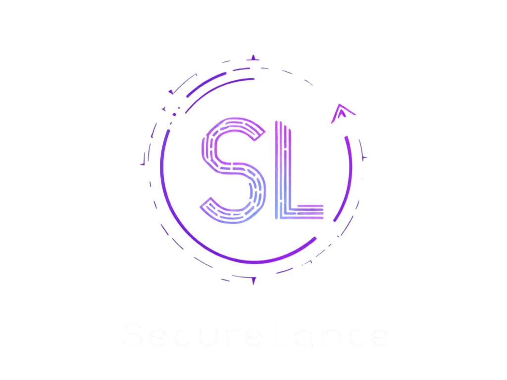

<p align="center">
  
</p>

<h1 align="center">
  
</h1>

<div align="center">
  <p>
    <a href="#code-of-conduct"></a>
    <a href="#how-to-contribute"></a>
    <a href="#development-workflow"></a>
    <a href="#pull-request-process"></a>
  </p>
</div>

<br />

## ✨ Thank You for Contributing!

First off, thank you for considering contributing to SecureLance! It's people like you that make SecureLance such a great tool for freelancers and clients worldwide. This document provides guidelines and steps for contributing.

<br />

## 🌟 Code of Conduct

This project and everyone participating in it is governed by the [SecureLance Code of Conduct](CODE_OF_CONDUCT.md). By participating, you are expected to uphold this code. Please report unacceptable behavior to [team@securelance.io](mailto:team@securelance.io).

<br />

## 🚀 How to Contribute

### Reporting Bugs

<table>
  <tr>
    <td width="80%">
      <p>Bugs are tracked as GitHub issues. Create an issue and provide the following information:</p>
      <ul>
        <li>Use a clear and descriptive title</li>
        <li>Describe the exact steps to reproduce the bug</li>
        <li>Describe the behavior you observed and what you expected to see</li>
        <li>Include screenshots if possible</li>
        <li>Mention your operating system, browser, and relevant environment details</li>
      </ul>
    </td>
    <td width="20%" align="center">
      
    </td>
  </tr>
</table>

### Suggesting Features

<table>
  <tr>
    <td width="20%" align="center">
      
    </td>
    <td width="80%">
      <p>Feature suggestions are also tracked as GitHub issues. When creating a feature request:</p>
      <ul>
        <li>Use a clear and descriptive title</li>
        <li>Provide a detailed description of the suggested feature</li>
        <li>Explain why this feature would be useful to most SecureLance users</li>
        <li>Include mockups or examples if applicable</li>
        <li>Specify which part of the platform (frontend, smart contracts, backend) your suggestion relates to</li>
      </ul>
    </td>
  </tr>
</table>

### Code Contributions

SecureLance welcomes code contributions through pull requests from forks of this repository.

<br />

## 💻 Development Workflow

<div align="center">
  
</div>

1. **Fork the Repository**
   - Click the "Fork" button at the top right of this repository

2. **Clone Your Fork**
   ```bash
   git clone https://github.com/your-username/SecureLance.git
   cd SecureLance
   ```

3. **Create a Branch**
   ```bash
   git checkout -b feature/amazing-feature
   ```

4. **Make Your Changes**
   - Make your changes to the codebase
   - Ensure your code follows our style guidelines
   - Write tests for your changes when applicable

5. **Test Your Changes**
   ```bash
   # For smart contracts
   npx hardhat test
   
   # For frontend
   npm run test
   
   # For backend
   cd backend && npm test
   ```

6. **Commit Your Changes**
   ```bash
   git commit -m "Add amazing feature"
   ```

7. **Push to Your Branch**
   ```bash
   git push origin feature/amazing-feature
   ```

8. **Create a Pull Request**
   - Go to your fork on GitHub
   - Click "New Pull Request"
   - Select your branch and submit the pull request

<br />

## 📝 Pull Request Process

<ol>
  <li>Ensure any install or build dependencies are removed before the end of the layer when doing a build</li>
  <li>Update the README.md with details of changes to the interface, if applicable</li>
  <li>The PR should work for all supported platforms and browsers</li>
  <li>Your PR requires approval from at least one maintainer</li>
  <li>You may merge the PR once it has the sign-off from maintainers</li>
</ol>

<br />

## 🧪 Running Tests

```bash
# Smart contract tests
npx hardhat test

# Frontend component tests
npm run test:components

# Backend API tests
cd backend && npm run test:api
```

<br />

## 📋 Style Guide

- **Solidity**: Follow the [Solidity Style Guide](https://docs.soliditylang.org/en/latest/style-guide.html)
- **JavaScript/TypeScript**: Follow the [Airbnb Style Guide](https://github.com/airbnb/javascript)
- **React**: Follow the [React Style Guide](https://reactjs.org/docs/style-guide.html)

<br />

## 🎉 Your Contributions Matter!

Your contributions to SecureLance help make it a better platform for freelancers and clients around the world. We appreciate your time, effort, and expertise in helping us build a more transparent and secure freelancing ecosystem on the blockchain.

<div align="center">
  <p>
    
  </p>
  <p>
    <strong>SecureLance Team</strong> - Building the future of work together
  </p>
</div>