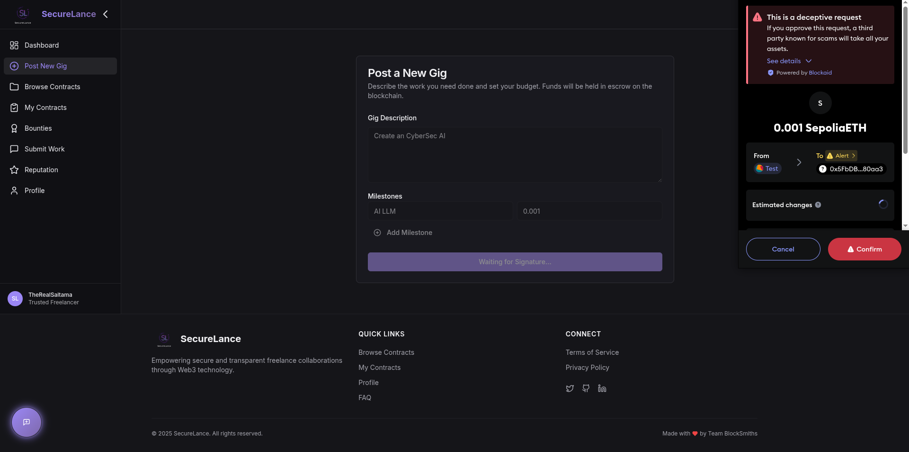
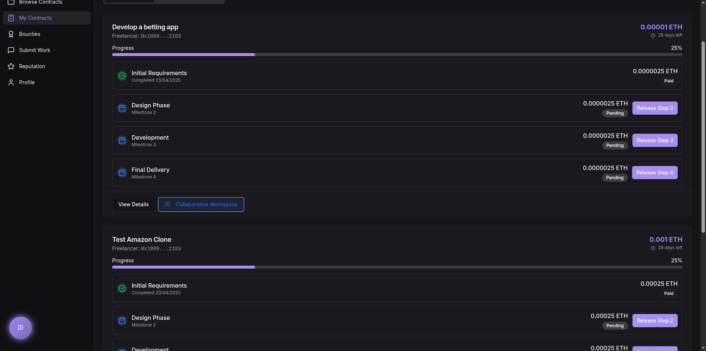
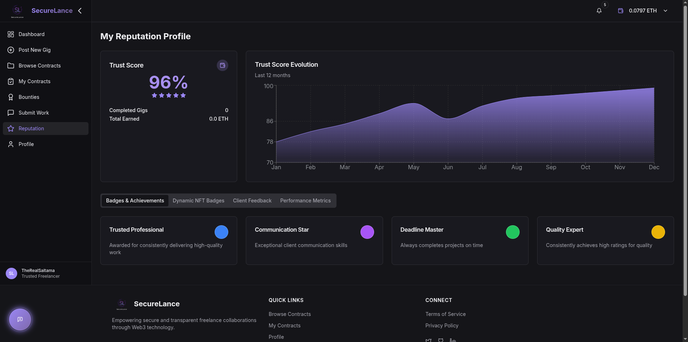
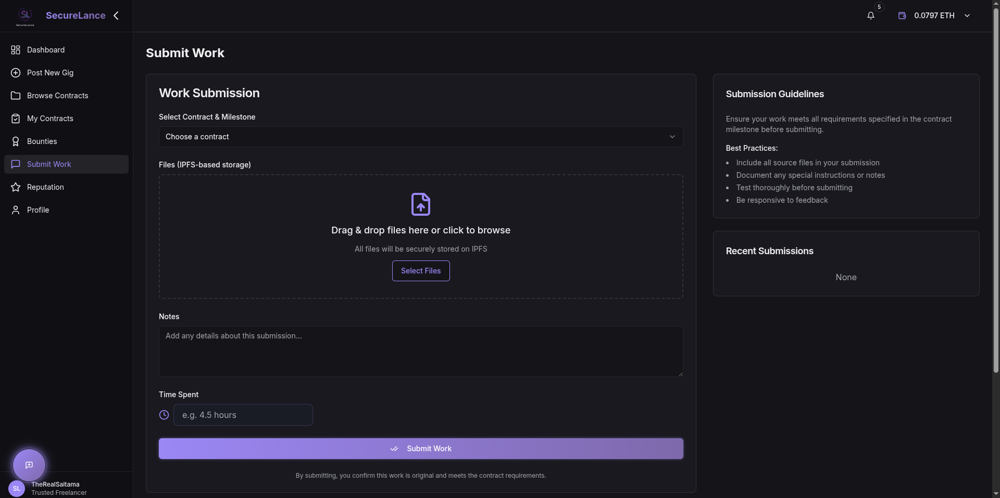

<p align="center">
  
</p>

<h1 align="center">
  <a href="#">
    
  </a>
</h1>

<p align="center">
  <a href="#"></a>
  <a href="#"></a>
  <a href="#"></a>
  <a href="#"></a>
</p>

<p align="center">
  
</p>

<div align="center">
  <h3>
    <a href="#features">Features</a>
    <span> | </span>
    <a href="#demo">Demo</a>
    <span> | </span>
    <a href="#tech-stack">Tech Stack</a>
    <span> | </span>
    <a href="#installation">Installation</a>
    <span> | </span>
    <a href="#architecture">Architecture</a>
  </h3>
</div>

<br />

<div align="center">
  <p>
    
  </p>
</div>

<br />

## ✨ Welcome to the Future of Freelancing

SecureLance is a revolutionary blockchain-powered freelancing platform that brings **trust**, **transparency** and **security** to the gig economy. By eliminating intermediaries and leveraging smart contracts, we're creating a new paradigm for client-freelancer relationships.

<p align="center">
  <kbd>
    
  </kbd>
</p>

<br />

## 🌟 Features

<table>
  <tr>
    <td width="50%">
      <h3 align="center">💰 Smart Contract Escrow</h3>
      <p align="center">
        <br/>
        Funds are securely locked in blockchain-based escrow until predefined conditions are met.
      </p>
    </td>
    <td width="50%">
      <h3 align="center">🔐 Milestone-Based Payments</h3>
      <p align="center">
        <br/>
        Release payments automatically as project milestones are completed and verified.
      </p>
    </td>
  </tr>
  <tr>
    <td width="50%">
      <h3 align="center">⭐ Decentralized Reputation</h3>
      <p align="center">
        <br/>
        Tamper-proof reputation system with NFT badges to showcase verified skills and credentials.
      </p>
    </td>
    <td width="50%">
      <h3 align="center">📁 IPFS File Submission</h3>
      <p align="center">
        <br/>
        Decentralized storage ensures deliverables remain accessible and immutable forever.
      </p>
    </td>
  </tr>
</table>

<br />

## 🚀 Tech Stack

<div align="center">
  <table>
    <tr>
      <th>Category</th>
      <th>Technologies</th>
    </tr>
    <tr>
      <td><strong>Frontend</strong></td>
      <td>
        
        
        
        
        
      </td>
    </tr>
    <tr>
      <td><strong>Backend</strong></td>
      <td>
        
        
        
      </td>
    </tr>
    <tr>
      <td><strong>Blockchain</strong></td>
      <td>
        
        
        
      </td>
    </tr>
    <tr>
      <td><strong>Storage</strong></td>
      <td>
        
        
      </td>
    </tr>
    <tr>
      <td><strong>Auth</strong></td>
      <td>
        
        
      </td>
    </tr>
  </table>
</div>

<br />

## 🔧 Installation

<div align="center">
  
</div>

```bash
# Clone the repository
git clone https://github.com/aakaru/SecureLance.git

# Navigate to the project directory
cd SecureLance

# Install frontend dependencies
npm install

# Start the frontend development server
npm run dev

# In a separate terminal, start the backend server
cd backend && npm install && npm start
```

<br />

## 🏛️ Architecture

<div align="center">
  
</div>

<br />

## 📊 Key Metrics

<div align="center">
  <table width="100%">
    <tr>
      <td width="33%" align="center">
        <h3>⚡ 99.9%</h3>
        <p>Uptime</p>
      </td>
      <td width="33%" align="center">
        <h3>🔒 0%</h3>
        <p>Transaction Fee</p>
      </td>
      <td width="33%" align="center">
        <h3>🚀 < 2s</h3>
        <p>Transaction Speed</p>
      </td>
    </tr>
  </table>
</div>

<br />

## 🌐 Roadmap

<div align="center">
  <table width="100%">
    <tr>
      <td width="25%" align="center">
        <h3>Q2 2025</h3>
        <p>✅ Platform Launch</p>
        <p>✅ Escrow Contract</p>
        <p>✅ Basic Reputation</p>
      </td>
      <td width="25%" align="center">
        <h3>Q3 2025</h3>
        <p>🔄 Mobile App</p>
        <p>🔄 Advanced Analytics</p>
        <p>🔄 Enhanced Disputes</p>
      </td>
      <td width="25%" align="center">
        <h3>Q4 2025</h3>
        <p>📝 Governance Token</p>
        <p>📝 DAO Integration</p>
        <p>📝 Professional Services</p>
      </td>
      <td width="25%" align="center">
        <h3>Q1 2026</h3>
        <p>📝 Cross-chain Support</p>
        <p>📝 Enterprise Solutions</p>
        <p>📝 Global Expansion</p>
      </td>
    </tr>
  </table>
</div>

<br />

## 🤝 Contributing

We welcome contributions from everyone! Check out the [contributing guidelines](CONTRIBUTING.md).

<br />

## 📜 License

This project is licensed under the GNU License - see the [LICENSE](LICENSE) file for details.

<br />

<div align="center">
  <p>
    <a href="https://github.com/therealsaitama/SecureLance">
      
    </a>
  </p>
  <p>
    <strong>SecureLance</strong> - Transforming the future of work, one block at a time.
  </p>
  <p>
    Made with ❤️ by the SecureLance Team
  </p>
</div>
